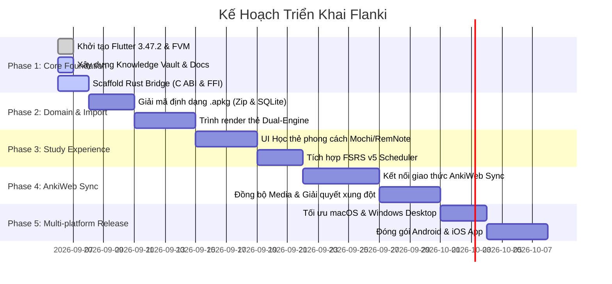

# 🗺️ Lộ Trình Phát Triển (Roadmap)

### Chi tiết các cột mốc:
1. **Milestone 1 — Alpha Foundation**: Hoàn thiện cầu nối FFI Dart $\leftrightarrow$ Rust C ABI; nạp thành công database `collection.anki2` rỗng.
2. **Milestone 2 — Import .apkg & Study Engine**: Import trọn vẹn bộ thẻ 600 từ TOEIC (.apkg); phát được audio MP3 và hiển thị câu ví dụ ngữ cảnh; chấm điểm 4 nút (Again, Hard, Good, Easy).
3. **Milestone 3 — AnkiWeb Sync**: Đăng nhập tài khoản AnkiWeb; đẩy và kéo log review hai chiều trơn tru.
4. **Milestone 4 — Production Release**: Xuất bản binary macOS, Windows, Linux, file Android `.apk` và iOS build.
