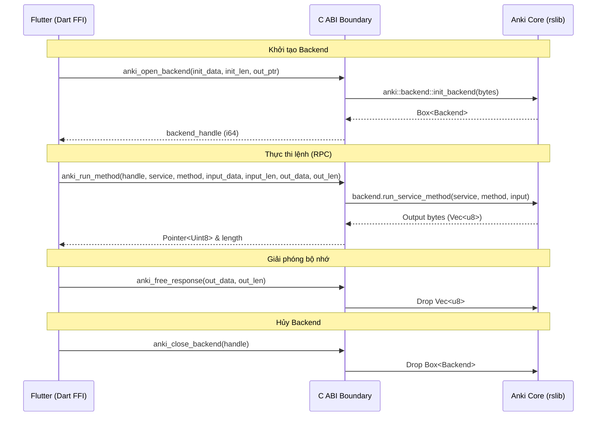

# 🌉 C ABI Bridge & Giao Tiếp Đa Nền Tảng (Rust FFI)

## 1. Triết Lý Thiết Kế: "Minimal C Boundary"
Thay vì sử dụng các thư viện code generation FFI phức tạp dễ bị lệch phiên bản khi nâng cấp Flutter (như `flutter_rust_bridge` cũ), Flanki áp dụng chuẩn **4 Primitive C Functions** tương tự như kiến trúc của **AnkiDroid (JNI)** và **Amgi (Swift C FFI)**:



---

## 2. Đặc Tả 4 Hàm C ABI Nguyên Thủy (`libanki_bridge`)

### `anki_open_backend`
```c
int anki_open_backend(const uint8_t *init_data, size_t init_len, int64_t *out_ptr);
```
* **Nhiệm vụ**: Khởi tạo cấu hình ban đầu (ngôn ngữ ưu tiên, cờ server, đường dẫn thư mục) và sinh đối tượng `Backend`.
* **Tham số**:
  * `init_data`: Buffer nhị phân chứa protobuf `BackendInit`. Nếu null/rỗng $\to$ dùng cấu hình mặc định.
  * `out_ptr`: Con trỏ tới ô nhớ 64-bit để nhận địa chỉ con trỏ `Box<Backend>`.
* **Mã trả về**: `0` (Thành công), `-1` (Lỗi).

### `anki_run_method`
```c
int anki_run_method(
    int64_t backend_ptr,
    uint32_t service,
    uint32_t method,
    const uint8_t *input_data,
    size_t input_len,
    uint8_t **out_data,
    size_t *out_len
);
```
* **Nhiệm vụ**: Kênh giao tiếp duy nhất cho **mọi thao tác** (mở collection, tạo deck, tính lịch FSRS, đồng bộ AnkiWeb).
* **Mã trả về**:
  * `0`: Lệnh thành công $\to$ `out_data` chứa protobuf payload phản hồi tương ứng.
  * `1`: Lỗi nghiệp vụ Anki $\to$ `out_data` chứa protobuf `BackendError` (mã lỗi, thông báo lỗi).
  * `-1`: Lỗi FFI / con trỏ không hợp lệ.

### `anki_free_response`
```c
void anki_free_response(uint8_t *data, size_t len);
```
* **Nhiệm vụ**: Giải phóng bộ đệm phản hồi do Rust cấp phát. Phía Dart **bắt buộc** phải gọi hàm này sau khi sao chép xong dữ liệu sang Dart Heap để chống rò rỉ bộ nhớ (Memory Leak).

### `anki_close_backend`
```c
void anki_close_backend(int64_t backend_ptr);
```
* **Nhiệm vụ**: Giải phóng instance `Backend` khi đóng app, đóng toàn bộ kết nối SQLite an toàn.
