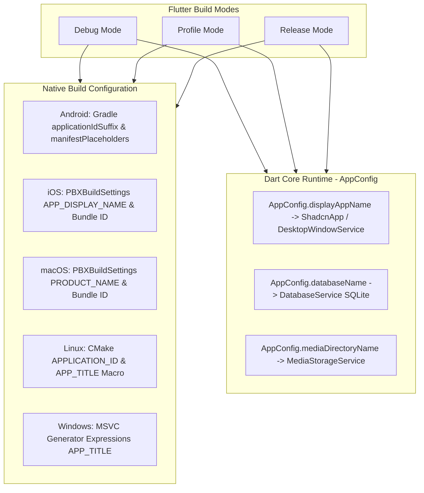

# 📱💻 Chiến Lược Hỗ Trợ Đa Nền Tảng (Desktop & Mobile)

Flanki hướng tới trải nghiệm đồng nhất trên cả 5 nền tảng: **macOS, Windows, Linux, Android, iOS**.

## 1. Đóng Gói Binary Rust Theo Nền Tảng

```
flanki/
├── macos/
│   └── Frameworks/libanki_bridge.dylib (Universal Binary x86_64 + arm64)
├── ios/
│   └── Frameworks/anki_bridge.xcframework (Device arm64 + Simulator)
├── android/
│   └── app/src/main/jniLibs/
│       ├── arm64-v8a/libanki_bridge.so
│       ├── armeabi-v7a/libanki_bridge.so
│       └── x86_64/libanki_bridge.so
├── windows/
│   └── anki_bridge.dll (x86_64)
└── linux/
    └── libanki_bridge.so (x86_64)
```

---

## 2. Thích Ứng Giao Diện Theo Kích Thước Màn Hình (Adaptive Layout)

| Thành phần | Desktop (Màn hình $\ge 900\text{px}$) | Mobile (Màn hình $< 900\text{px}$) |
| :--- | :--- | :--- |
| **Điều hướng** | Sidebar cố định 240px bên trái | Bottom Navigation Bar 4 tab |
| **Phím tắt học** | Phím `Space` lật thẻ, `1`-`4` đánh giá | Vuốt trái (Again), vuốt phải (Good), chạm lật thẻ |
| **Màn hình học** | Tập trung không xao nhãng (Centered 720px Card) | Toàn màn hình (Full width edge-to-edge) |
| **Nhập liệu** | Hỗ trợ gõ câu trả lời trực tiếp từ bàn phím rời | Bàn phím ảo tự động focus hoặc chọn trắc nghiệm |

---

## 3. Phân Tách Môi Trường Build & Cô Lập Dữ Liệu (Build Isolation)

Để phục vụ phát triển (dev/debug) song song với bản phát hành (release) mà không ghi đè ứng dụng hoặc làm bẩn cơ sở dữ liệu thật của người dùng, toàn bộ 5 platform và tầng Dart Runtime áp dụng cơ chế phân tách build độc lập theo **Build Mode**:

### 3.1. Ma Trận Định Danh & Tên Ứng Dụng Đa Nền Tảng

| Platform | Thuộc tính | Debug | Profile | Release (Production) |
| :--- | :--- | :--- | :--- | :--- |
| **Tên hiển thị (App Name)** | Tên chung | `[DEBUG] Flanki` | `[PROFILE] Flanki` | `Flanki` |
| **Android** | `applicationId` | `com.flanki.flanki.debug` | `com.flanki.flanki.profile` | `com.flanki.flanki` |
| | `android:label` | `${appName}` (`[DEBUG] Flanki`) | `${appName}` (`[PROFILE] Flanki`) | `${appName}` (`Flanki`) |
| | FileProvider Authority | `${applicationId}.fileprovider` | `${applicationId}.fileprovider` | `${applicationId}.fileprovider` |
| **iOS** | Bundle Identifier | `com.flanki.flanki.debug` | `com.flanki.flanki.profile` | `com.flanki.flanki` |
| | `CFBundleDisplayName` | `$(APP_DISPLAY_NAME)` | `$(APP_DISPLAY_NAME)` | `$(APP_DISPLAY_NAME)` |
| **macOS** | Bundle Identifier | `com.flanki.flanki.debug` | `com.flanki.flanki.profile` | `com.flanki.flanki` |
| | `PRODUCT_NAME` | `[DEBUG] Flanki` | `[PROFILE] Flanki` | `Flanki` |
| **Linux** | `APPLICATION_ID` | `com.flanki.flanki.debug` | `com.flanki.flanki.profile` | `com.flanki.flanki` |
| | HeaderBar & Window Title | `[DEBUG] Flanki` | `[PROFILE] Flanki` | `Flanki` |
| **Windows** | Window Title | `L"[DEBUG] Flanki"` | `L"[PROFILE] Flanki"` | `L"Flanki"` |
| **Dart Runtime** | `AppConfig.displayAppName` | `[DEBUG] Flanki` | `[PROFILE] Flanki` | `Flanki` |
| | SQLite Database Name | `flanki_debug` | `flanki_profile` | `flanki` |
| | Media Directory Name | `flanki_media_debug` | `flanki_media_profile` | `flanki_media` |

---

### 3.2. Cơ Chế Triển Khai Kỹ Thuật Chi Tiết



#### 1. Android (`android/app/build.gradle.kts` & `AndroidManifest.xml`)
- Áp dụng `applicationIdSuffix = ".debug"` và `".profile"` trong từng `buildType`.
- Đặt nhãn ứng dụng qua `manifestPlaceholders["appName"] = "[DEBUG] $baseAppName"`.
- `FileProvider` authorities sử dụng `${applicationId}.fileprovider` — tự động phân tách theo suffix, triệt tiêu lỗi va chạm content provider (`INSTALL_FAILED_CONFLICTING_PROVIDER`).

#### 2. iOS (`ios/Runner.xcodeproj/project.pbxproj` & `Info.plist`)
- Thiết lập trực tiếp trên 3 target configuration: `Debug`, `Profile`, `Release`.
- `Info.plist` đọc biến `$(APP_DISPLAY_NAME)` cho cả `CFBundleDisplayName` và `CFBundleName`.

#### 3. macOS (`macos/Runner.xcodeproj/project.pbxproj`)
- Cấu hình `PRODUCT_NAME` và `PRODUCT_BUNDLE_IDENTIFIER` riêng biệt cho 3 build configurations, giúp chạy song song 2 app trên macOS Dock và thư mục Application Support.

#### 4. Linux (`linux/CMakeLists.txt` & `linux/runner/my_application.cc`)
- Dựa trên `CMAKE_BUILD_TYPE` để tự động nội suy `APPLICATION_ID` (`${BASE_APPLICATION_ID}.debug`) và `APP_TITLE`.
- `my_application.cc` áp dụng macro `APP_TITLE` cho GTK HeaderBar và Window Title.

#### 5. Windows (`windows/runner/CMakeLists.txt` & `windows/runner/main.cpp`)
- Sử dụng generator expression của MSVC multi-config:
  `$<$<CONFIG:Debug>:APP_TITLE=L"[DEBUG] ${APP_BASE_NAME}">`
- `main.cpp` gọi `window.Create(APP_TITLE, origin, size)`.

#### 6. Cô Lập Dữ Liệu Tầng Dart Runtime (`AppConfig`)
- **Vấn đề trên Desktop**: Trên Windows/Linux/macOS, đường dẫn `getApplicationDocumentsDirectory()` hoặc `getApplicationSupportDirectory()` dùng chung thư mục user nếu file trùng tên.
- **Giải pháp**:
  - `DatabaseService` khởi tạo qua `AppConfig.databaseName`: Bản debug kết nối vào file SQLite `flanki_debug.sqlite`, hoàn toàn tách biệt với `flanki.sqlite` của bản release.
  - `MediaStorageService` lưu trữ media vào thư mục `flanki_media_debug`.
  - Giúp dev thoải mái xóa dữ liệu, cày thẻ thử nghiệm mà không bao giờ làm hỏng hay đè collection học thật.

