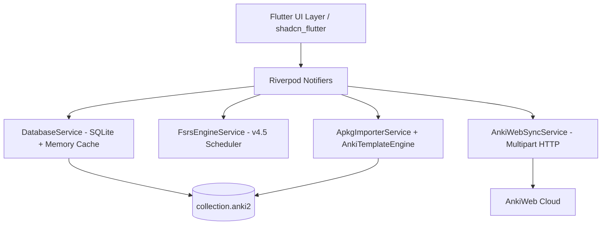

# ⚡ Kiến Trúc Pure Dart Core Engine & Reactive Storage

## 1. Mục Tiêu Thiết Kế
Thay vì phụ thuộc ngay vào C ABI FFI với Rust rslib vốn phức tạp khi đóng gói trên các môi trường sandbox (iOS App Store, WebAssembly), Flanki xây dựng một **Pure Dart Core Engine** đạt chuẩn:
1. **Zero native compilation overhead**: Biên dịch trực tiếp 100% bằng Flutter toolchain chuẩn.
2. **Sub-16ms Reactive Latency**: Mọi thao tác đổi trạng thái thẻ (học, xóa, sửa, gắn cờ) phản hồi tức thì lên UI thông qua kỹ thuật **Optimistic In-Memory Caching**.
3. **Anki Schema 100% Compatible**: Trực tiếp đọc và ghi vào SQLite database collection.anki2.

---

## 2. Các Thành Phần Cốt Lõi

### A. DatabaseService (lib/core/storage/database_service.dart)
* **Dual-Tier State**:
  - **In-Memory Cache**: Danh sách `List<Card>` và `List<Deck>` được duy trì trong RAM.
  - **Persistent SQLite Layer**: Đồng bộ dữ liệu nền xuống database SQLite `collection.anki2` bằng `package:sqlite3`.
* **Optimistic Update & Undo**:
  - Khi xóa thẻ (`deleteCard`), thẻ bị gỡ khỏi RAM cache ngay lập tức để UI cập nhật không độ trễ, sau đó lệnh SQL `DELETE FROM cards WHERE id = ?` chạy ngầm.
  - Hỗ trợ hoàn tác (`undoDelete` / `addCard`) khôi phục tức thời cả RAM và Disk.

### B. FSRS Engine Service (lib/core/fsrs/fsrs_engine_service.dart)
* Triển khai thuật toán **FSRS v4.5** với 17 tham số trọng số chuẩn hóa (`w0` đến `w16`).
* Tính toán 3 biến số cốt lõi:
  - **Stability ($S$)**: Độ bền trí nhớ (số ngày để xác suất nhớ giảm còn 90%).
  - **Difficulty ($D$)**: Độ khó nội tại của thẻ (1 đến 10).
  - **Retrievability ($R$)**: Khả năng gợi nhớ tức thời $R = (1 + F \cdot t/S)^C$.
* Tính toán 4 khoảng thời gian ôn tiếp theo tương ứng với 4 nút: `Again`, `Hard`, `Good`, `Easy`.

### C. APKG Importer & AnkiTemplateEngine (lib/core/importer/)
* Giải nén file `.apkg` (Zip) bằng `archive`.
* Đọc bảng `col`, `notes`, `cards` và trích xuất `media` mapping file.
* `AnkiTemplateEngine`:
  - Giải mã Cloze deletion: `{{c1::answer::hint}}` -> Front hiển thị `[...]` hoặc hint, Back hiển thị câu trả lời nổi bật.
  - Giải mã cú pháp Mustache: `{{Field}}`, điều kiện hiển thị `{{#Field}}...{{/Field}}`, điều kiện phủ định `{{^Field}}...{{/Field}}`.

### D. RichCardContent & Audio (lib/ui/screens/study/widgets/rich_card_content.dart)
* Render định dạng HTML/CSS từ note types của Anki bằng `flutter_widget_from_html_core`.
* Tự động phát hiện tag âm thanh `[sound:filename.mp3]`, tích hợp `audioplayers` phát audio mượt mà khi lật thẻ.

### E. AnkiWeb Auth & Sync (lib/core/sync/)
* Giao thức xác thực HTTP `multipart/form-data` tới endpoint `https://sync.ankiweb.net/sync/hostKey`.
* Lưu trữ session token bảo mật với `flutter_secure_storage` (iOS Keychain / Android KeyStore / Windows DPAPI).
* Đồng bộ 2 chiều toàn diện (Bộ thẻ, Thẻ học, Trạng thái FSRS, Lịch sử `revlog`) và Tệp tin đa phương tiện (`/msync/`).
* Điều phối xung đột tự động với `SyncFlowCoordinator` và `SyncConflictDialog` (Responsive Modal / BottomSheet).

### F. Reactive State Management & Code Generation (lib/core/notifiers/)
* Toàn bộ trạng thái phiên học (`StudySessionState`), ngữ pháp (`GrammarSessionState`), cài đặt (`StudySettings`), thống kê (`StatsData`) được định nghĩa bằng **`@freezed`** bất biến với deep equality.
* Di chuyển toàn bộ Notifiers sang **`riverpod_annotation: ^4.0.7`** với code generation tự động (`riverpod_generator: ^4.0.9`), giúp giảm thiểu boilerplate và đảm bảo an toàn kiểu dữ liệu cao nhất.
* Chi tiết xem tại: [[01-Architecture/06-State-Management-and-Render-Optimization|06. Kiến Trúc State Freezed & Tối Ưu Hóa Rebuild Riverpod]].
