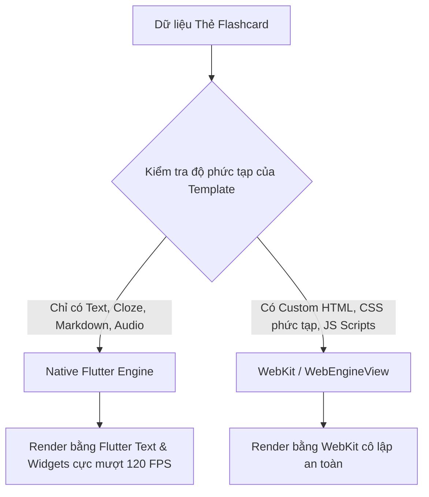

# ⚡ Cơ Chế Dual-Engine Render Thẻ (Native + WebKit)

Một trong những hạn chế lớn nhất của Anki trên mobile là phải chạy Webview cho toàn bộ thẻ, gây tốn RAM và trễ cảm ứng. Flanki giải quyết bằng kiến trúc **Dual-Engine**:

## 1. Engine 1: Native Flutter Widget Engine (90% số thẻ)
* Áp dụng cho các thẻ từ vựng thông thường (Basic, Cloze deletion, TOEIC vocab, hình ảnh, audio).
* Thẻ được vẽ trực tiếp bằng Skia / Impeller của Flutter.
* **Tốc độ**: Render dưới 4ms, tiết kiệm 80% RAM, animation 120 FPS.

## 2. Engine 2: Embedded WebEngine (10% số thẻ còn lại)
* Áp dụng khi bộ thẻ người dùng import có chứa CSS phức tạp hoặc script Javascript tuỳ biến.
* Chạy trong WebView cô lập, hỗ trợ đầy đủ các tính năng nâng cao của Anki Desktop.
