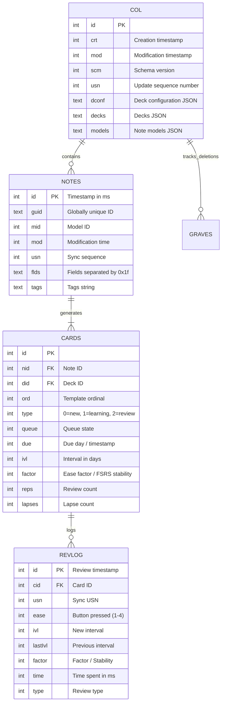

# 🗄️ Cấu Trúc Cơ Sở Dữ Liệu SQLite collection.anki2

Dữ liệu của Flanki được tổ chức chuẩn theo lược đồ SQLite của Anki:

```mermaid
erDiagram
    COL ||--o{ NOTES : contains
    NOTES ||--|{ CARDS : generates
    CARDS ||--o{ REVLOG : logs
    COL ||--o{ GRAVES : tracks_deletions

    COL {
        int id PK
        int crt "Creation timestamp"
        int mod "Modification timestamp"
        int scm "Schema version"
        int usn "Update sequence number"
        text dconf "Deck configuration JSON"
        text decks "Decks JSON"
        text models "Note models JSON"
    }

    NOTES {
        int id PK "Timestamp in ms"
        text guid "Globally unique ID"
        int mid "Model ID"
        int mod "Modification time"
        int usn "Sync sequence"
        text flds "Fields separated by 0x1f"
        text tags "Tags string"
    }

    CARDS {
        int id PK
        int nid FK "Note ID"
        int did FK "Deck ID"
        int ord "Template ordinal"
        int type "0=new, 1=learning, 2=review"
        int queue "Queue state"
        int due "Due day / timestamp"
        int ivl "Interval in days"
        int factor "Ease factor / FSRS stability"
        int reps "Review count"
        int lapses "Lapse count"
    }

    REVLOG {
        int id PK "Review timestamp"
        int cid FK "Card ID"
        int usn "Sync USN"
        int ease "Button pressed (1-4)"
        int ivl "New interval"
        int lastIvl "Previous interval"
        int factor "Factor / Stability"
        int time "Time spent in ms"
        int type "Review type"
    }
```
