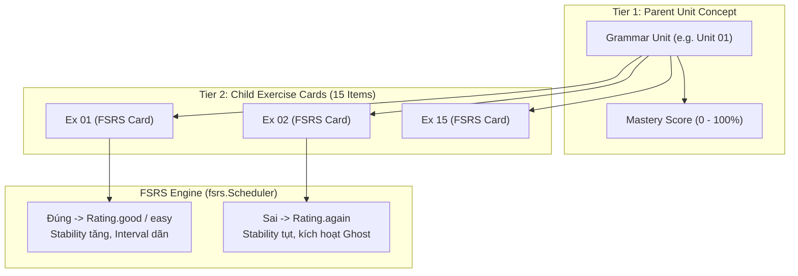

# 📚 Đặc Tả Kỹ Thuật Module Ngữ Pháp Học Thuật (Academic Grammar Spec)

Tài liệu đặc tả toàn diện kiến trúc dữ liệu, thuật toán lặp lại ngắt quãng (FSRS v4.5) kết hợp cơ chế Ghost Review, chuẩn hóa tương tác bài tập và lưu trữ cho Module Ngữ Pháp trong Flanki.

---

## 1. Tổng Quan & Mục Tiêu Nghiệp Vụ

Module Ngữ Pháp giải quyết bài toán: **Chuyển hóa ngữ pháp từ "nhận biết thụ động" (Passive Recognition) sang "phản xạ sản sinh chuẩn xác" (Active Automaticity)** phục vụ các kỳ thi chuẩn hóa quốc tế (IELTS Band 8.0+, SAT, GRE, GMAT, THPTQG Chuyên).

* **Dung lượng kho dữ liệu**: 36 Units phân theo 3 cấp độ (Level 1: 8 Units Foundation, Level 2: 17 Units Intermediate, Level 3: 11 Units Advanced C1/C2).
* **Số lượng bài tập**: 540 bài tập chuẩn hóa (15 bài/Unit: 5 Choice, 5 Error ID, 5 Cloze).
* **100% Offline-First**: Toàn bộ dữ liệu nằm trong Asset Bundle, lưu trữ tiến trình và tính toán thuật toán thực thi cục bộ trên thiết bị qua SQLite (Drift).

---

## 2. Mô Hình Dữ Liệu Chi Tiết (Data Schema)

### 2.1. Cấu Trúc Unit (`GrammarUnit`)
```json
{
  "unitId": "unit-01-present-simple-vs-continuous",
  "title": "Unit 01: Present Simple vs. Present Continuous (...)",
  "category": "tenses",
  "level": 1,
  "coreConcept": "Tư duy bản xứ về tính bền vững vs tạm thời...",
  "formulas": {
    "presentSimple": "S + V(s/es) | S + do/does + not + V_bare...",
    "presentContinuous": "S + am/is/are + V-ing..."
  },
  "commonTraps": [
    {
      "trap": "Bẫy 1: 'Always' kết hợp Hiện tại tiếp diễn để phàn nàn",
      "exampleWrong": "My roommate always forgets to lock the front door...",
      "exampleRight": "My roommate is always forgetting to lock the front door...",
      "note": "Diễn tả sự khó chịu, bực tức trước hành động tiêu cực lặp lại..."
    }
  ],
  "exercises": [ /* 15 Exercise Items */ ],
  "extraGuides": { /* Hướng dẫn mở rộng: stativeVerbsGuide, modalPerfectGuide... */ }
}
```

### 2.2. Cấu Trúc Bài Tập (`GrammarExercise`)
Mỗi bài tập gồm các thuộc tính bắt buộc:
* `id` (`String`): Mã định danh (ví dụ `ex_01` ... `ex_15`).
* `type` (`GrammarExerciseType`):
  * `choice`: Trắc nghiệm 4 lựa chọn. `options` chứa 4 chuỗi, `correctAnswer` khớp chính xác 1 trong 4.
  * `error_id`: Tìm lỗi sai dạng gạch chân. Đoạn văn chứa 4 vị trí gắn thẻ `[A]`, `[B]`, `[C]`, `[D]`. `options` luôn là `['A', 'B', 'C', 'D']`.
  * `cloze`: Điền từ vào chỗ trống `________ (base_word)`. `options` là rỗng `[]`, `correctAnswer` là đáp án chuẩn xác.
* `difficulty` (`int`): 1 (Nhận biết), 2 (Thông hiểu), 3 (Vận dụng nâng cao).
* `prompt` (`String`): Đề bài ngữ cảnh hoàn chỉnh.
* `explanation` (`GrammarExplanation`):
  * `translation`: Bản dịch tiếng Việt học thuật chuẩn xác.
  * `keySignal`: Dấu hiệu ngữ pháp nhận diện trong câu.
  * `rule`: Quy tắc ngữ pháp nền tảng.
  * `whyCorrect`: Lý giải cặn kẽ vì sao đáp án đúng.
  * `distractorBreakdown`: Phân tích chi tiết tại sao các đáp án còn lại là bẫy/sai.

### 2.3. Chuẩn Hóa Serialization Với `json_serializable` & `json_annotation`
Toàn bộ mã phân tích JSON thủ công (`json['key'] as ...`) đã được thay thế bằng code generation tự động:
* **Models**: `GrammarUnit`, `GrammarExercise`, `GrammarExplanation`, `GrammarTrap` đều khai báo `@JsonSerializable(explicitToJson: true)` sinh mã `*.g.dart`.
* **Enums**: `GrammarExerciseType`, `GrammarLevel`, `GrammarDifficulty`, `GrammarCategory` dùng `@JsonEnum(valueField: ...)` và `@JsonValue`.
* **Xử lý Dynamic Guides**: Thuộc tính `extraGuides` trong `GrammarUnit` sử dụng `@JsonKey(readValue: _readExtraGuides, includeToJson: false)` để tự động bắt tất cả các thẻ lý thuyết mở rộng (như `stativeVerbsGuide`, `modalPerfectGuide`, v.v.), đồng thời `toJson()` nối lại toàn bộ key này, bảo đảm round-trip 100% nguyên vẹn.

---

## 3. Thuật Toán Học Tối Ưu (Optimal Grammar Learning Algorithm)

### 3.1. Thang Tiến Trình Nhận Thức 3 Bậc (Cognitive Scaffolding)
Trong mỗi phiên làm 15 bài của Unit, người học được dẫn dắt qua 3 tầng nhận thức:
1. **Câu 1 – 5 (Multiple Choice)**: Tầng Nhận Diện (Recognition). Rèn luyện phản xạ phát hiện `keySignal` và phân tích loại trừ các phương án gây nhiễu (`distractorBreakdown`).
2. **Câu 6 – 10 (Error Identification)**: Tầng Phân Tích & Phản Biện (Critical Error Analysis). Luyện phát hiện bẫy ngụy biện (`commonTraps`) ẩn sâu trong các thành phần câu.
3. **Câu 11 – 15 (Cloze Deletion)**: Tầng Sản Sinh (Active Production). Không có phương án gợi ý; não bộ bắt buộc kích hoạt truy hồi chủ động (Active Recall) để chia đúng thì, thể, thể thức từ.

---

### 3.2. Mô Hình FSRS v4.5 Hai Tầng (Two-Tier Adaptive Model)



* **Đơn vị lập lịch (Scheduling Entity)**: Mỗi bài tập trong tổng số 540 bài tập được gán một trạng thái `CardModel` ngầm với các tham số FSRS:
  * $S$ (Stability): Độ bền trí nhớ (số ngày trước khi khả năng quên chạm 10%).
  * $D$ (Difficulty): Độ khó nội tại của dạng bài đối với người học (thang 1 - 10).
  * $R$ (Retrievability): Xác suất nhớ tại thời điểm hiện tại:
    $$R(t) = \left(1 + \text{factor} \cdot \frac{t}{S}\right)^{-1}$$
* **Điểm thành thạo của Unit (Unit Mastery Score)**:
  $$\text{Mastery}(\text{Unit}) = \frac{1}{15} \sum_{i=1}^{15} \min\left(100, \frac{S_i}{30} \times 100\right)$$
  (Một Unit đạt 100% khi toàn bộ 15 câu đạt $S \ge 30$ ngày).

---

### 3.3. Cơ Chế Ghost Review (Khắc Chế "Leeches" & Lỗ Hổng Ngữ Pháp)
Lấy cảm hứng từ cơ chế triệt tiêu điểm yếu của **Bunpro**:
1. **Kích hoạt tức thời (Immediate Ghost Flagging)**: Khi người học trả lời sai bất kỳ câu hỏi nào trong phiên làm bài:
   * Bản ghi tiến độ được đánh dấu `isGhost = true`.
   * Thẻ bài tập được xếp vào danh sách `SessionGhostQueue`.
2. **Phiên can thiệp cuối bài (Immediate Remediation)**:
   * Sau khi hoàn tất câu 15, nếu `SessionGhostQueue` có bài làm sai, ứng dụng không kết thúc ngay mà hiển thị màn hình: **"Thử Thách Xóa Điểm Yếu (Ghost Challenge)"**.
   * Yêu cầu làm lại các câu sai. Làm đúng $\to$ hoàn tất phiên.
3. **Lịch ôn tập dồn dập (Condensed Spaced Repetition)**:
   * Câu hỏi gắn cờ `isGhost` có lịch ôn riêng: **24 giờ $\to$ 48 giờ**.
   * Chỉ khi người học trả lời đúng câu hỏi đó trong 2 lần ôn tập liên tiếp ở chế độ review hàng ngày, cờ `isGhost` mới được gỡ bỏ.

---

### 3.4. Chuẩn Hóa Chấm Điểm Điền Từ (Cloze Normalization)
Để tránh ức chế cho người dùng khi gõ phím trên mobile hoặc máy tính:
* **Chuẩn hóa khoảng trắng & ký tự**:
  1. `trim()` bỏ khoảng trắng thừa đầu/cuối.
  2. Gom cụm nhiều dấu cách liên tiếp thành 1 dấu cách duy nhất: `replace(RegExp(r'\s+'), ' ')`.
  3. Chuyển chữ hoa thành chữ thường: `toLowerCase()` (trừ trường hợp tên riêng/đầu câu).
  4. Bỏ qua dấu câu dính liền ở cuối (chấm `.`, phẩy `,`).
* **Hỗ trợ dấu nháy đơn tiếng Anh**: Đồng bộ dấu nháy cong (`’`) và nháy thẳng (`'`) (ví dụ: `haven't` $\leftrightarrow$ `haven’t`).

---

## 4. Lưu Trữ Dữ Liệu SQLite (Drift Schema)

Bảng dữ liệu `GrammarProgressEntries` trong `lib/core/storage/app_database.dart`:

```dart
class GrammarProgressEntries extends Table {
  TextColumn get unitId => text()();
  TextColumn get exerciseId => text()();
  RealColumn get stability => real().withDefault(const Constant(0.0))();
  RealColumn get difficulty => real().withDefault(const Constant(0.0))();
  DateTimeColumn get due => dateTime().nullable()();
  DateTimeColumn get lastStudied => dateTime().nullable()();
  IntColumn get reps => integer().withDefault(const Constant(0))();
  IntColumn get lapses => integer().withDefault(const Constant(0))();
  IntColumn get state => integer().withDefault(const Constant(0))(); // 0=new, 1=learning, 2=review
  BoolColumn get isGhost => boolean().withDefault(const Constant(false))();
  BoolColumn get isCompleted => boolean().withDefault(const Constant(false))();
  TextColumn get lastUserAnswer => text().nullable()();
  DateTimeColumn get updatedAt => dateTime().withDefault(currentDateAndTime)();

  @override
  Set<Column> get primaryKey => {unitId, exerciseId};
}
```

---

## 5. Đặc Tả Giao Diện & Tương Tác (`shadcn_flutter` Zinc)

1. **Thẩm mỹ & Màu sắc**:
   * Áp dụng triệt để bảng màu **Zinc** trung tính (`zinc-50` đến `zinc-950`).
   * Phản hồi trạng thái:
     * Thành công / Đúng: `emerald-500` / `emerald-600` với nền dịu `emerald-50` (Dark mode: `emerald-950/40`).
     * Thất bại / Sai / Ghost: `rose-500` / `rose-600` với nền dịu `rose-50` (Dark mode: `rose-950/40`).
2. **Tương tác Độc Quyền cho Dạng Bài Tìm Lỗi Sai (`error_id`)**:
   * Không hiển thị 4 nút bấm vô hồn A, B, C, D dưới câu.
   * Render đoạn văn thành các đoạn text inline; các cụm từ gắn thẻ `[A]`, `[B]`, `[C]`, `[D]` hiển thị dưới dạng **Interactive Pill Tag** lồng ngay trong ngữ cảnh câu.
   * Người dùng chạm trực tiếp vào cụm từ nghi ngờ sai trên câu văn để chọn.
3. **Bảng Giải Thích Tức Thì (Instant Explanation Sheet)**:
   * Hiển thị ngay sau khi bấm "Kiểm tra" / "Nộp bài".
   * Phân tách 4 khối màu mạch lạc:
     * Dịch nghĩa tiếng Việt (Typography tinh tế).
     * Dấu hiệu nhận biết (`keySignal`).
     * Quy tắc vàng (`rule`).
     * Phân tích bẫy các phương án sai (`distractorBreakdown`).

---

## 6. Chuẩn Hóa Kiểu Dữ Liệu & Hằng Số (Production Zero-Hardcoding Standards)

Để đảm bảo mã nguồn đạt tiêu chuẩn production-ready, toàn bộ giá trị kiểu dữ liệu dạng text/số nguyên thô được chuyển sang strongly-typed Enums và Hằng số tập trung:

### 6.1. Hằng Số Tập Trung (`GrammarConstants`)
* `totalUnits = 36`: Tổng số chuyên đề ngữ pháp học thuật.
* `exercisesPerUnit = 15`: Số câu hỏi trong mỗi Unit.
* `totalExercises = 540`: Tổng số câu hỏi trên toàn bộ kho bài tập.
* `level1UnitCount = 8`, `level2UnitCount = 17`, `level3UnitCount = 11`: Phân bố số lượng bài theo cấp độ.
* `choiceExercisesPerUnit = 5`, `errorIdExercisesPerUnit = 5`, `clozeExercisesPerUnit = 5`: Phân bố định dạng bài.
* `masteryStabilityCapDays = 30.0`: Ngưỡng ổn định trí nhớ $S \ge 30$ ngày tương ứng 100% độ thành thạo mục.
* `defaultDesiredRetention = 0.9`: Tỷ lệ ghi nhớ mục tiêu mặc định của thuật toán FSRS v4.5 (90%).
* `passAccuracyThreshold = 80.0`: Ngưỡng độ chính xác đạt yêu cầu trong phiên học (80%).
* `assetDir = 'assets/data/grammar'`: Đường dẫn gốc của gói asset JSON.
* `errorIdOptionLabels = ['A', 'B', 'C', 'D']`: Nhãn tiêu chuẩn 4 phương án cho bài tìm lỗi sai.
* `globalReviewUnitId = 'grammar_review'`: Mã định danh phiên ôn tập tổng hợp toàn bộ các Unit.

### 6.2. Hệ Thống Enum Chuẩn Hóa (`grammar_enums.dart`)
1. **`GrammarExerciseType`**:
   * `choice` ('choice', 'TRẮC NGHIỆM')
   * `errorId` ('error_id', 'TÌM LỖI SAI')
   * `cloze` ('cloze', 'ĐIỀN TỪ')
2. **`GrammarLevel`**:
   * `foundation` (Level 1: Foundation (8), Blue)
   * `intermediate` (Level 2: Intermediate (17), Purple)
   * `advanced` (Level 3: Advanced C1/C2 (11), Orange)
3. **`GrammarDifficulty`**:
   * `recognition` (1, 'Nhận Biết (Recognition)')
   * `analysis` (2, 'Phân Tích & Bẫy (Analysis)')
   * `production` (3, 'Sản Sinh Thực Hành (Production)')
4. **`GrammarCategory`**:
   * Ánh xạ chính xác 27 chuyên đề ngữ pháp học thuật (tenses, voice, modals, conditionals, subjunctive, clauses, inversion, verb_forms, conjunctions, subject_verb_agreement, comparisons, articles, determiners, pronouns, prepositions, adjectives_adverbs, noun_clauses, sentence_structure, causative_verbs, phrasal_verbs, questions, emphasis, parallel_structure, participles, word_formation, collocations, capstone).
5. **`GrammarPracticeMode`**:
   * `unit`: Luyện tập bài học theo từng Unit.
   * `ghost`: Chế độ thử thách sửa lỗi Ghost Review tập trung.
   * `due`: Ôn tập các câu hỏi đến hạn theo lịch FSRS.

---

## 7. Quản Lý Asset Bundle & Quy Trình Dọn Dẹp Dữ Liệu (Asset Hygiene & Backup Strategy)

### 7.1. Vấn Đề Phình To Asset Bundle (Asset Bloat)
- Ban đầu, thư mục `assets/data/grammar/` chứa 36 file dữ liệu chuẩn `.json` và 36 file sao lưu `.original.json`.
- Mặc dù `pubspec.yaml` chỉ khai báo `assets/data/grammar/`, Flutter Asset Bundler mặc định đóng gói toàn bộ các file bên trong thư mục vào binary phát hành (`app.so` / `flutter_assets/`).
- Hậu quả: Dư thừa ~1.64 MB dữ liệu không sử dụng trong file cài đặt APK/IPA/Desktop installer.

### 7.2. Giải Pháp Tối Ưu Hóa & Di Chuyển Sao Lưu
1. **Dọn Dẹp Asset Bundle**:
   - Loại bỏ hoàn toàn toàn bộ 36 file `*.original.json` ra khỏi `assets/data/grammar/`.
   - `assets/data/grammar/` chỉ giữ lại duy nhất 36 file JSON chính thức đã được định dạng và tối ưu hóa (`unit_01.json` ... `unit_36.json`).
2. **Khu Vực Lưu Trữ Backup Ngoài Bundle (`tool/data_backup/grammar/`)**:
   - Tất cả các file thô hoặc bản sao lưu gốc được lưu trữ tại `tool/data_backup/grammar/`. Thư mục này nằm ngoài luồng đóng gói asset của Flutter.
3. **Chuẩn Hóa Công Cụ Xử Lý Dữ Liệu (`tool/format_grammar.py`)**:
   - Script tự động định dạng `tool/format_grammar.py` được cập nhật: Khi cần sao lưu, script sẽ ghi vào `tool/data_backup/grammar/` thay vì tạo file tạm trong cây assets.
   - Thêm cờ `--backup-dir` rõ ràng và đảm bảo không bao giờ làm ô nhiễm thư mục assets của ứng dụng.
