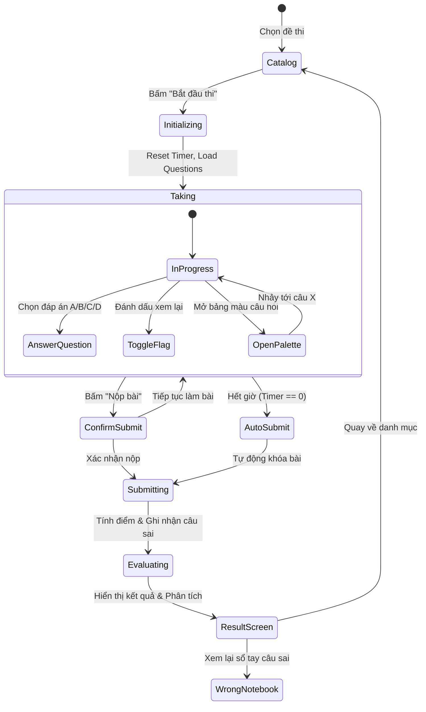

# 🎓 Đặc Tả Kiến Trúc & Thuật Toán Phân Hệ Luyện Thi (Exam Module Spec)

Tài liệu này đặc tả toàn bộ mô hình dữ liệu, vòng đời thi, thuật toán tính điểm, cơ chế sổ tay câu sai (Wrong Notebook) và kiến trúc tối ưu hiệu năng của phân hệ **Luyện Thi Chuẩn Hóa (Exam Module)** trong ứng dụng **Flanki**.

---

## 1. Tầm Nhìn & Mục Tiêu Nghiệp Vụ

Phân hệ Exam bổ trợ cho việc học thẻ Anki và ngữ pháp bằng trải nghiệm thi thử áp lực thời gian thực (Simulated Timed Exams) theo chuẩn quốc tế (JLPT N5 – N1, TOEIC, v.v.):
1. **Mô Phỏng Phòng Thi Thật (Real Exam Simulation)**:
   - Đồng hồ đếm ngược với tính năng tự động nộp bài (auto-submit) khi hết giờ.
   - Giao diện Fullscreen không phân tâm, ẩn hoàn toàn navigation rails/bars.
   - Bảng màu palette câu hỏi trực quan: phân biệt câu đã làm, chưa làm, câu đánh dấu cờ (flagged).
2. **Khép Kín Vòng Lặp Học Tập (Closed-Loop Learning)**:
   - Thi thử ➔ Chấm điểm phân tích ➔ Tự động lưu câu sai vào **Sổ Tay Câu Sai (Wrong Notebook)** ➔ Ôn luyện chuyển trạng thái ➔ Nắm vững kiến thức.
3. **Hiệu Năng Cao & Offline First**:
   - Hoạt động 100% không cần kết nối internet.
   - Đề thi mẫu được nạp từ file JSON nén, lưu trữ trong SQLite.
   - Tối ưu hóa Rebuild Scope: Render 120 FPS mượt mà kể cả khi đồng hồ tick từng giây.

---

## 2. Cấu Trúc Dữ Liệu & Schema Đề Thi (Exam Schema)

### 2.1. Định Dạng JSON Chuẩn Của Đề Thi
Đề thi được lưu trữ dưới định dạng JSON độc lập tại `assets/data/exams/` (ví dụ: `jlpt_n3_mock_01.json`):

```json
{
  "id": "jlpt_n3_mock_01",
  "title": "JLPT N3 Mock Exam 01",
  "category": "jlpt_n3",
  "durationMinutes": 60,
  "passingScore": 95,
  "totalScore": 180,
  "sections": [
    {
      "id": "sec_vocab_grammar",
      "title": "Language Knowledge (Vocabulary / Grammar)",
      "passages": [
        {
          "id": "pas_01",
          "content": "..."
        }
      ],
      "questions": [
        {
          "id": "q_01",
          "passageId": null,
          "prompt": "この文章の空欄に入る適切な言葉を選びなさい。",
          "options": ["選択肢1", "選択肢2", "選択肢3", "選択肢4"],
          "correctAnswer": 2,
          "score": 2,
          "explanation": "Chi tiết giải thích ngữ pháp hoặc từ vựng..."
        }
      ]
    }
  ]
}
```

### 2.2. Bảng Dữ Liệu SQLite (Drift Database)
1. **`exam_papers`**:
   - `id` (TEXT PRIMARY KEY)
   - `title` (TEXT)
   - `category` (TEXT) - ánh xạ `ExamCategory` enum
   - `duration_minutes` (INTEGER)
   - `passing_score` (INTEGER)
   - `total_score` (INTEGER)
   - `content_json` (TEXT) - toàn bộ cấu trúc sections/questions
   - `updated_at` (INTEGER)
2. **`exam_results`**:
   - `id` (TEXT PRIMARY KEY)
   - `exam_id` (TEXT)
   - `score` (INTEGER)
   - `max_score` (INTEGER)
   - `is_passed` (BOOLEAN)
   - `time_spent_seconds` (INTEGER)
   - `user_answers_json` (TEXT) - map `questionId -> selectedOptionIndex`
   - `completed_at` (INTEGER)
3. **`wrong_questions`**:
   - `id` (TEXT PRIMARY KEY)
   - `exam_id` (TEXT)
   - `question_id` (TEXT)
   - `user_answer` (TEXT) - rỗng nếu bỏ trắng
   - `correct_answer` (TEXT)
   - `status` (TEXT) - `unresolved` (0), `reviewing` (1), `mastered` (2)
   - `last_reviewed_at` (INTEGER)

---

## 3. Vòng Đời Làm Bài Thi (Exam Lifecycle)



### 3.1. Cơ Chế Đồng Hồ Đếm Ngược & Auto-Submit
- Khởi tạo thời gian: `durationMinutes * 60` giây.
- `Timer.periodic(const Duration(seconds: 1))` trừ lùi `remainingSeconds`.
- Khi `remainingSeconds <= 0`: Hủy timer, gọi tức thì `submitExam()` và điều hướng sang `ExamResultScreen`.
- Hiển thị cảnh báo màu đỏ khi thời gian thi còn dưới 5 phút (`remainingSeconds <= 300`).

### 3.2. Thuật Toán Chấm Điểm & Phân Loại
```dart
int earnedScore = 0;
int totalPossibleScore = 0;
final wrongQuestions = <WrongQuestionRecord>[];

for (final question in allQuestions) {
  totalPossibleScore += question.score;
  final userAnswer = state.selectedAnswers[question.id];
  
  if (userAnswer != null && userAnswer == question.correctAnswer) {
    earnedScore += question.score;
  } else {
    // Ghi nhận vào danh sách câu sai
    wrongQuestions.add(
      WrongQuestionRecord(
        id: const Uuid().v4(),
        examId: examPaper.id,
        questionId: question.id,
        userAnswer: userAnswer != null ? question.options[userAnswer] : '',
        correctAnswer: question.options[question.correctAnswer],
        status: WrongQuestionStatus.unresolved,
        createdAt: DateTime.now(),
      ),
    );
  }
}

final isPassed = earnedScore >= examPaper.passingScore;
```

---

## 4. Bảng Màu Câu Hỏi (Question Palette BottomSheet)

- Bảng điều khiển dạng lưới trượt từ dưới lên (Modal Bottom Sheet) giúp thí sinh bao quát toàn bộ đề thi:
  - **Màu Xám Nhạt**: Chưa làm.
  - **Màu Primary (Xanh/Đen)**: Đã chọn đáp án.
  - **Viền Hổ Phách (Amber) + Biểu Tượng Cờ**: Câu được đánh dấu xem lại (`isFlagged`).
  - **Viền Đậm Nổi Bật**: Câu hỏi hiện tại đang xem.
- Khi chạm vào ô số câu hỏi: Đóng bottom sheet và cuộn mượt hoặc chuyển ngay lập tức tới câu hỏi tương ứng trong bài thi.

---

## 5. Sổ Tay Câu Sai (Wrong Question Notebook)

### 5.1. Vòng Đời Trạng Thái Câu Sai
Mỗi câu sai trong sổ tay trải qua 3 giai đoạn:
1. **Chưa xử lý (`unresolved`)**: Tự động tạo sau khi nộp bài thi.
2. **Đang ôn (`reviewing`)**: Người dùng đã mở ra đọc giải thích và đánh dấu đang củng cố lại kiến thức.
3. **Đã thuần thục (`mastered`)**: Người dùng đã làm đúng lại trong các lần thi thử sau hoặc đã hiểu rõ bản chất; ẩn khỏi danh sách cần học gấp.

### 5.2. Tính Năng Xem Lại Chuyên Sâu
- Hiển thị song song:
  - **Đoạn văn ngữ cảnh (Passage)** (nếu có).
  - **Lựa chọn của bạn** (Đỏ nếu sai, kèm nhãn Chưa trả lời nếu bỏ trống).
  - **Đáp án chính xác** (Xanh lá).
  - **Giải thích chi tiết (Explanation)** kèm phân tích các bẫy thường gặp.

---

## 6. Tối Ưu Hóa Rebuild & Hiệu Năng Giao Diện

Chi tiết xem tại [[01-Architecture/06-State-Management-and-Render-Optimization|06. Kiến Trúc State Freezed & Tối Ưu Hóa Rebuild Riverpod]]:
1. **Tách `ExamTimerBadge`**:
   - Timer tick 1 giây/lần.
   - Chỉ `ExamTimerBadge` rebuild. Toàn bộ `ExamTakingScreen` không re-render.
2. **Fine-grained Selector**:
   - Dùng `.select((s) => s.currentQuestion)` để chỉ rebuild thẻ câu hỏi khi chuyển câu.
   - Dùng `.select((s) => s.selectedAnswers[qId])` trong `ExamOptionCard` để chỉ đổi màu 2 option cũ và mới được click thay vì build lại cả 4 options.
3. **Không Vượt Quá 300 Dòng**:
   - Màn hình `exam_taking_screen.dart` phân rã thành:
     - `exam_timer_badge.dart` (hoặc widget nội bộ tối ưu)
     - `exam_taking_dialogs.dart` (Dialog thoát & Dialog nộp bài)
     - `exam_questions_sheet.dart` (Question palette bottom sheet)
     - `exam_question_cards.dart` (`ExamPassageCard`, `ExamOptionCard`)

---

## 7. Tiêu Chuẩn Kiểm Thử (Verification Standards)

Phân hệ Exam được bảo vệ 100% bằng tự động hóa:
- **Unit Tests (`test/unit/storage/exam_repository_test.dart`)**:
  - Tự động nạp đề mẫu từ asset JSON khi database rỗng.
  - Chuyển trạng thái câu sai (`unresolved` ➔ `reviewing` ➔ `mastered`).
  - Headless asset loading an toàn khi chạy không có Flutter UI engine.
- **Widget Tests (`test/widget/screens/exam_navigation_test.dart`)**:
  - Điều hướng tab Exams trên Desktop qua click và `Ctrl+4`.
  - Điều hướng tab Exams trên Mobile qua bottom bar.
  - Zero overflow trên màn hình hẹp 320px.
